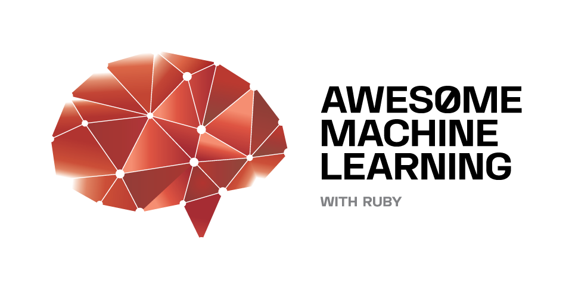

 

[[RubyNLP](https://github.com/arbox/nlp-with-ruby) |
 [RubyDataScience](https://github.com/arbox/data-science-with-ruby) |
 [RubyInterop](https://github.com/arbox/ruby-interoperability)]

# Awesome Machine Learning with Ruby [][ruby]

> Curated List of Ruby Machine Learning Links and Resources

[Machine Learning][ml] is a field of [Computational Science][cs] -
often nested under [AI][ai] research - with many practical
applications due to the ability of resulting algorithms to
systematically implement a specific solution without explicit
programmer's instructions. Obviously many algorithms need a definition
of [features][fe] to look at or a biggish [training set][ts] of data to derive the
solution from.

This curated list comprises [_awesome_][awesome] libraries,
data sources, tutorials and presentations about [Machine Learning][ml]
utilizing the [Ruby][ruby] programming language.

A lot of useful resources on this list come from the development by
[The Ruby Science Foundation][sciruby], our [contributors][contributors] and
our own day to day work on various ML applications.

:sparkles: Every [contribution](contributing.md) is welcome! Add links through pull
requests or create an issue to start a discussion.

Follow us on [Twitter](https://twitter.com/NonWebRuby) and please spread
the word using the `#RubyML` hash tag!

<!-- nodoc -->
## Contents

<!-- toc -->

- [:sparkles: Tutorials](#sparkles-tutorials)
- [Machine Learning Libraries](#machine-learning-libraries)
  * [Frameworks](#frameworks)
  * [Neural networks](#neural-networks)
  * [Kernel methods](#kernel-methods)
  * [Evolutionary algorithms](#evolutionary-algorithms)
  * [Bayesian methods](#bayesian-methods)
  * [Decision trees](#decision-trees)
  * [Clustering](#clustering)
  * [Linear classifiers](#linear-classifiers)
  * [Statistical models](#statistical-models)
  * [Gradient boosting](#gradient-boosting)
- [Applications of machine learning](#applications-of-machine-learning)
- [Data structures](#data-structures)
- [Data visualization](#data-visualization)
- [Articles, Posts, Talks, and Presentations](#articles-posts-talks-and-presentations)
- [Projects and Code Examples](#projects-and-code-examples)
- [Heroku buildpacks](#heroku-buildpacks)
- [Books, Blogs, Channels](#books-blogs-channels)
- [Community](#community)
- [Related Resources](#related-resources)
- [License](#license)

<!-- tocstop -->

<!-- doc -->

## :sparkles: Tutorials

Please help us to fill out this section! :smiley:

- [How to implement linear regression in Ruby](https://www.practicalai.io/implementing-linear-regression-using-ruby/)
  [[code](https://github.com/daugaard/example-linear-regression)]
- [How to implement classification using logistic regression in Ruby](https://www.practicalai.io/implementing-classification-using-logistic-regression-in-ruby/)
- [How to implement simple binary classification using a Neural Network in Ruby](https://www.practicalai.io/implementing-simple-classification-using-neural-network-in-ruby/)
  [[code](https://github.com/daugaard/example-neural-network)]
- [How to implement classification using a SVM in Ruby](https://www.practicalai.io/implementing-classification-using-a-svm-in-ruby/)
  [[code](https://github.com/daugaard/example-svm)]
- [Unsupervised learning using k-means clustering in Ruby](https://www.practicalai.io/unsupervised-learning-using-k-means-clustering-in-ruby/)
  [[code](https://github.com/daugaard/example-kmeans-clustering)]
- [Teaching an AI to play a simple game using Q-Learning in Ruby](https://www.practicalai.io/teaching-ai-play-simple-game-using-q-learning/)
  [[code](https://github.com/daugaard/q-learning-simple-game)]
- [Teaching a Neural Network to play a game using Q-Learning in Ruby](https://www.practicalai.io/teaching-a-neural-network-to-play-a-game-with-q-learning/)
  [[code](https://github.com/daugaard/q-learning-simple-game/tree/neuralnetwork)]
- [Using the Python scikit-learn machine learning library in Ruby using PyCall](https://www.practicalai.io/using-scikit-learn-machine-learning-library-in-ruby-using-pycall/)
  [[code](https://github.com/daugaard/scikit-learn-from-ruby)]
- [How to _evolve_ neural networks in Ruby using the Machine Learning Workbench](https://github.com/giuse/machine_learning_workbench/blob/master/examples/neuroevolution.rb)

## Machine Learning Libraries

[Machine Learning][ml] algorithms in pure Ruby or written in other
programming languages with appropriate bindings for Ruby.

### Frameworks

- [weka](https://github.com/paulgoetze/weka-jruby) -
  JRuby bindings for Weka, different ML algorithms implemented through Weka.
- [ai4r](https://github.com/SergioFierens/ai4r) -
  Artificial Intelligence for Ruby.
- [classifier-reborn](https://github.com/jekyll/classifier-reborn) -
  General classifier module to allow Bayesian and other types of classifications.
  [[dep: GLS](#gls)]
- [scoruby](https://github.com/asafschers/scoruby) -
  Ruby scoring API for [PMML](http://dmg.org/pmml/v4-3/GeneralStructure.html) (Predictive Model Markup Language).
- [rblearn](https://github.com/himkt/rblearn) - Feature Extraction and Crossvalidation library.
- [data_modeler](https://github.com/giuse/data_modeler) -
  Model your data with machine learning. Ample test coverage, examples to start fast, complete documentation. Production ready since 1.0.0.
- [shogun](https://github.com/shogun-toolbox/shogun) - Polyfunctional and mature
  machine learning toolbox with [Ruby bindings](https://github.com/shogun-toolbox/shogun/tree/develop/src/interfaces/ruby).
- [aws-sdk-machinelearning](https://github.com/aws/aws-sdk-ruby) -
  Machine Learning API of the Amazon Web Services.
- [azure_mgmt_machine_learning](https://github.com/Azure/azure-sdk-for-ruby) -
  Machine Learning API of the Microsoft Azure.
- [machine_learning_workbench](https://github.com/giuse/machine_learning_workbench) -
  Growing machine learning framework written in pure Ruby, high performance computing using
  [Numo](https://github.com/ruby-numo/), CUDA bindings through [Cumo](https://github.com/sonots/cumo).
  Currently implementating neural networks, evolutionary strategies, vector quantization, and plenty of
  examples and utilities.
- [Deep NeuroEvolution](https://github.com/giuse/DNE) -
  Experimental setup based on the [machine_learning_workbench](https://github.com/giuse/machine_learning_workbench)
  towards searching for deep neural networks (rather than training) using evolutionary algorithms. Applications to the
  [OpenAI Gym](https://github.com/openai/gym) using [PyCall](https://github.com/mrkn/pycall.rb).
- [rumale](https://github.com/yoshoku/rumale) -
  Machine Learninig toolkit in Ruby with wide range of implemented algorithms
  (SVM, Logistic Regression, Linear Regression, Random Forest etc.) and
  interfaces similar to [Scikit-Learn][scikit] in Python.
- [eps](https://github.com/ankane/eps) - Bayesian Classification and Linear Regression with exports
  using [PMML](http://dmg.org/pmml/v4-3/GeneralStructure.html) and an alternative backend using [GSL][gsl].

### Neural networks

- [neural-net-ruby](https://github.com/gbuesing/neural-net-ruby) -
  Neural network written in Ruby.
- [ruby-fann](https://github.com/tangledpath/ruby-fann) -
  Ruby bindings to the [Fast Artificial Neural Network Library (FANN)](http://leenissen.dk/fann/wp/).
- [cerebrum](https://github.com/irfansharif/cerebrum) -
  Experimental implementation for Artificial Neural Networks in Ruby.
- [tlearn-rb](https://github.com/josephwilk/tlearn-rb) -
  Recurrent Neural Network library for Ruby.
- [brains](https://github.com/jedld/brains-jruby) -
  Feed-forward neural networks for JRuby based on
  [brains](https://github.com/jedld/brains).
- [machine_learning_workbench](https://github.com/giuse/machine_learning_workbench/tree/master/lib/machine_learning_workbench/neural_network) -
  Framework including pure-Ruby implementation of both feed-forward and recurrent neural networks
  (fully connected). Training available using neuroevolution (Natural Evolution Strategies algorithms).
- [rann](https://github.com/mikecmpbll/rann) -
  Flexible Ruby ANN implementation with backprop (through-time, for recurrent
  nets), gradient checking, adagrad, and parallel batch execution.

### Deep learning

- [tensor_stream](https://github.com/jedld/tensor_stream) -
  Ground-up and standalone reimplementation of TensorFlow for Ruby.
- [red-chainer](https://github.com/red-data-tools/red-chainer) -
  Deep learning framework for Ruby.
- [tensorflow](https://github.com/somaticio/tensorflow.rb) - Ruby bindings for [TensorFlow](https://www.tensorflow.org/).
- [ruby-dnn](https://github.com/unagiootoro/ruby-dnn) - Simple deep learning for Ruby.
- [torch-rb](https://github.com/ankane/torch-rb) - Ruby bindings for [LibTorch](https://github.com/pytorch/pytorch)
  using [rice](https://github.com/jasonroelofs/rice).

### Kernel methods

- [rb-libsvm](https://github.com/febeling/rb-libsvm) -
  Support Vector Machines with Ruby and the [LIBSVM](https://www.csie.ntu.edu.tw/~cjlin/libsvm/) library.
  [[dep: bundled](#bundled)]

### Evolutionary algorithms

- [machine_learning_workbench](https://github.com/giuse/machine_learning_workbench/tree/master/lib/machine_learning_workbench/optimizer/natural_evolution_strategies) -
  Framework including pure-Ruby implementations of Natural Evolution Strategy algorithms
  (black-box optimization), specifically Exponential NES (XNES),
  Separable NES (sNES), Block-Diagonal NES (BDNES) and more.
  Applications include neural network search/training (neuroevolution).
- [simple_ga](https://github.com/giuse/simple_ga) -
  Simplest Genetic Algorithms implementation in Ruby.

### Bayesian methods

- [linnaeus](https://github.com/djcp/linnaeus) -
  Redis-backed Bayesian classifier.
- [naive_bayes](https://github.com/reddavis/Naive-Bayes) -
  Simple Naive Bayes classifier.
- [nbayes](https://github.com/oasic/nbayes) -
  Full-featured, Ruby implementation of Naive Bayes.

### Decision trees

- [decisiontree](https://github.com/igrigorik/decisiontree) -
  Decision Tree ID3 Algorithm in pure Ruby.
  [[dep: GraphViz](#graphviz) |
        [post](https://www.igvita.com/2007/04/16/decision-tree-learning-in-ruby/)].

### Clustering

- [flann](https://github.com/mariusmuja/flann) -
  Fast Library for Approximate Nearest Neighbors.
  [[flann](#flann)]
- [kmeans-clusterer](https://github.com/gbuesing/kmeans-clusterer) -
  k-means clustering in Ruby.
- [k_means](https://github.com/reddavis/K-Means) -
  Attempting to build a fast, memory efficient K-Means program.
- [knn](https://github.com/reddavis/knn) -
  Simple K Nearest Neighbour Algorithm.

### Linear classifiers

- [liblinear-ruby-swig](https://github.com/tomz/liblinear-ruby-swig) -
  Ruby interface to LIBLINEAR (much more efficient than LIBSVM for text classification).
- [liblinear-ruby](https://github.com/kei500/liblinear-ruby) -
  Ruby interface to LIBLINEAR using SWIG.

### Statistical models

- [rtimbl](https://github.com/maspwr/rtimbl) -
  Memory based learners from the Timbl framework.
- [lda-ruby](https://github.com/ealdent/lda-ruby) -
  Ruby implementation of the [LDA](https://en.wikipedia.org/wiki/Latent_Dirichlet_allocation)
  (Latent Dirichlet Allocation) for automatic Topic Modelling and Document Clustering.
- [maxent_string_classifier](https://github.com/mccraigmccraig/maxent_string_classifier) -
  JRuby maximum entropy classifier for string data, based on the OpenNLP Maxent framework.
- [omnicat](https://github.com/mustafaturan/omnicat) -
  Generalized rack framework for text classifications.
- [omnicat-bayes](https://github.com/mustafaturan/omnicat-bayes) -
  Naive Bayes text classification implementation as an OmniCat classifier strategy.
  [[dep: bundled](#bundled)]

### Gradient boosting

- [xgboost](https://github.com/PairOnAir/xgboost-ruby) &mdash;
  Ruby bindings for XGBoost.
  [[dep: XGBoost](#xgboost)]
- [xgb](https://github.com/ankane/xgb) &mdash;
  Ruby bindings for XGBoost.
  [[dep: XGBoost](#xgboost)]
- [lightgbm](https://github.com/ankane/lightgbm) &mdash;
  Ruby bindings for LightGBM.
  [[dep: LightGBM](#lightgbm)]

## Applications of machine learning

- [phashion](https://github.com/westonplatter/phashion) -
  Ruby wrapper around pHash, the perceptual hash library for detecting duplicate multimedia files.
  [[ImageMagick](#imagemagick) | [libjpeg](#libjpeg)]

## Data structures

If you're going to implement your own ML algorithms you're probably interested
in storing your feature sets efficiently. Look for appropriate
[data structures](https://github.com/arbox/data-science-with-ruby#data-structures)
in our [Data Science with Ruby][ds-with-ruby] list.

## Data visualization

Please refer to the [Data Visualization](https://github.com/arbox/data-science-with-ruby#visualization)
section on the [Data Science with Ruby][ds-with-ruby] list.

## Articles, Posts, Talks, and Presentations

- 2019
  - _TensorStream: Bringing Machine Learning to Ruby_ by [Joseph Emmanuel Dayo](https://www.linkedin.com/in/jdayo/)
    [[post](https://medium.com/@joseph.dayo/tensorstream-bringing-machine-learning-to-ruby-114582060e3d)]
  - _Easy machine learning with Ruby using SVMKit_ by [@kojix](https://twitter.com/kojix2dayo)
    [[post](https://dev.to/kojix2/easy-machine-learning-with-ruby-using-svmkit-4n86)]
- 2018
  - _Deep Learning Programming on Ruby_ by [Kenta Murata](https://twitter.com/mrkn)
    &amp; [Yusaku Hatanaka ](https://twitter.com/hatappi)
    [[slides](https://speakerdeck.com/mrkn/deep-learning-programming-on-ruby) |
          [page](https://rubykaigi.org/2018/presentations/mrkn.html)]
  - _How to use trained Keras and TensorFlow machine learning models within Ruby on Rails_ by [Denis Sellu](https://twitter.com/denis_sellu)
    [[post](https://www.cookieshq.co.uk/posts/how-to-use-trained-keras-and-tensorflow-machine-learning-models-within-ruby-on-rails)]
- 2017
  - _Scientific Computing on JRuby_ by [Prasun Anand](https://twitter.com/prasun_anand)
    [[slides](https://www.slideshare.net/PrasunAnand2/fosdem2017-scientific-computing-on-jruby) |
    [video](https://ftp.fau.de/fosdem/2017/K.4.201/ruby_scientific_computing_on_jruby.mp4) |
    [slides](https://www.slideshare.net/PrasunAnand2/scientific-computing-on-jruby) |
    [slides](https://www.slideshare.net/PrasunAnand2/scientific-computation-on-jruby)]
  - _Is it Food? An Introduction to Machine Learning_ by [Matthew Mongeau](https://twitter.com/halogenandtoast)
    [[video](https://www.youtube.com/watch?v=8G709hKkthY) |
          [slides](https://www.slideshare.net/halogenandtoast/is-it-food)]
  - _Bayes is BAE_ by [Richard Schneeman](https://twitter.com/schneems)
    [[video](https://www.youtube.com/watch?v=bQSzZrDDV80) |
          [slides](https://speakerdeck.com/schneems/bayes-is-bae)]
  - _Ruby Roundtable: Machine Learning in Ruby_ by [RubyThursday](https://rubythursday.com/)
    [[video](https://www.youtube.com/watch?v=ScIFARN0jCo)]
- 2016
  - _Practical Machine Learning with Ruby_ by [Jordan Hudgens](https://twitter.com/jordanhudgens)
    [[tutorial](https://www.crondose.com/2016/12/practical-machine-learning-ruby/)]
  - _Deep Learning: An Introduction for Ruby Developers_ by [Geoffrey Litt](https://twitter.com/geoffreylitt)
    [[slides](https://speakerdeck.com/geoffreylitt/deep-learning-an-introduction-for-ruby-developers)]
  - _How I made a pure-Ruby word2vec program more than 3x faster_ by [Kei Sawada](https://twitter.com/remore)
    [[slides](https://speakerdeck.com/remore/how-i-made-a-pure-ruby-word2vec-program-more-than-3x-faster)]
  - _Dōmo arigatō, Mr. Roboto: Machine Learning with Ruby_ by [Eric Weinstein](https://twitter.com/ericqweinstein)
    [[slides](https://speakerdeck.com/ericqweinstein/domo-arigato-mr-roboto-machine-learning-with-ruby) |
          [video](https://www.youtube.com/watch?v=T1nFQ49TyeA)]
  - _Building a Recommendation Engine with Machine Learning Techniques_ by [Brian Sam-Bodden](https://twitter.com/bsbodden)
    [[video](https://www.youtube.com/watch?v=SRnM_P_ygqI)]
  - :sparkles: _SciRuby Machine Learning: Current Status and Future_ by [Kenta Murata](https://twitter.com/mrkn)
    [[slides](https://speakerdeck.com/mrkn/sciruby-machine-learning-current-status-and-future) |
          [video: jp](https://www.youtube.com/watch?v=gfQ8XEy7vO4)]
  - _Ruby Roundtable: Intro to Tensorflow_ by [RubyThursday](https://rubythursday.com/)
    [[video](https://www.youtube.com/watch?v=pYC5mXHUWkc)]
- 2015
  - _Machine Learning made simple with Ruby_ by [Lorenzo Masini](https://twitter.com/rugginoso)
    [[post](https://www.leanpanda.com/blog/2015-08-24-machine-learning-automatic-classification/)]
  - _Using Ruby Machine Learning to Find Paris Hilton Quotes_ by [Rick Carlino](https://github.com/RickCarlino)
    [[tutorial](https://web.archive.org/web/20160414072324/http://datamelon.io/blog/2015/using-ruby-machine-learning-id-paris-hilton-quotes.html)]
- 2014
  - _Test Driven Neural Networks_ by [Matthew Kirk](https://twitter.com/mjkirk)
    [[video](https://www.youtube.com/watch?v=ppf8m-3uXvU&t=36s)]
  - _Five machine learning techniques that you can use in your Ruby apps today_ by [Benjamin Curtis](https://twitter.com/stympy)
    [[video](https://www.youtube.com/watch?v=crziu7dk6Vw) |
          [slides](https://speakerdeck.com/stympy/machine-learning-techniques)]
  - _Machine Learning for Fun and Profit_ by [John Paul Ashenfelter](https://twitter.com/johnashenfelter)
    [[video](https://www.youtube.com/watch?v=KC5MtKHm1O4)]
- 2013
  - _Sentiment Analysis using Support Vector Machines in Ruby_ by [Matthew Kirk](https://twitter.com/mjkirk)
    [[video](https://www.youtube.com/watch?v=iSug6CgxWxc) |
          [code](https://github.com/hexgnu/sentiment_analyzer)]
  - _Recommender Systems with Ruby_ by [Marcel Caraciolo](https://twitter.com/marcelcaraciolo)
    [[slides](https://www.slideshare.net/marcelcaraciolo/recommender-systems-with-ruby-adding-machine-learning-statistics-etc)]
  - _Detecting Faces with Ruby: FFI in a Nutshell_ by [Marc Berszick]()
    [[post](https://www.sitepoint.com/detecting-faces-with-ruby-ffi-in-a-nutshell/)]
- 2012
  - _Machine Learning with Ruby, Part One_ by [Vasily Vasinov](https://twitter.com/vasinov)
    [[tutorial](https://www.vasinov.com/blog/machine-learning-with-ruby-part-one/)]
  - _Recurrent Neural Networks in Ruby_ by [Joseph Wilk](https://twitter.com/josephwilk)
    [[post](http://blog.josephwilk.net/ruby/recurrent-neural-networks-in-ruby.html)]
  - _Recommendation Engines using Machine Learning, and JRuby_ by [Matthew Kirk](https://twitter.com/mjkirk)
    [[video](https://www.youtube.com/watch?v=hsZcrlbBg_0)]
  - _Practical Machine Learning and Rails_ by [Andrew Cantino](https://twitter.com/tectonic)
    and [Ryan Stout](https://twitter.com/ryanstout)
    [[video](https://www.youtube.com/watch?v=vy_zQ1-F0JI)]

- 2011
  - _Clustering in Ruby_ by [Colin Drake](https://twitter.com/colinfdrake)
    [[post](https://colindrake.me/post/k-means-clustering-in-ruby/)]
  - _Text Classification using Support Vector Machines in Ruby_ by [Rimas Silkaitis](https://twitter.com/neovintage)
    [[post](http://neovintage.org/2011/11/14/text-classification-using-support/)]
- 2010
  - _bayes_motel – Bayesian classification for Ruby_ by [Mike Perham](https://twitter.com/mperham)
    [[post](http://www.mikeperham.com/2010/04/28/bayes_motel-bayesian-classification-for-ruby/)]
  - _Intelligent Ruby: Getting Started with Machine Learning_ by [Ilya Grigorik](https://twitter.com/igrigorik)
    [[video](https://vimeo.com/22513786)]
- 2009

- 2008
  - _Support Vector Machines (SVM) in Ruby_ by [Ilya Grigorik](https://twitter.com/igrigorik)
    [[post](https://www.igvita.com/2008/01/07/support-vector-machines-svm-in-ruby/)]
- 2007
  - _Decision Tree Learning in Ruby_ by [Ilya Grigorik](https://twitter.com/igrigorik)
    [[post](https://www.igvita.com/2007/04/16/decision-tree-learning-in-ruby/)]

## Projects and Code Examples

- [Wine Clustering](https://github.com/hexgnu/wine_clustering) -
  Wine quality estimations clustered with different algorithms.
- [simple_ga](https://github.com/giuse/simple_ga) -
  Basic (working) demo of Genetic Algorithms in Ruby.

## Heroku buildpacks

- [GSL and Ruby buildpack](https://github.com/tomwolfe/heroku-buildpack-gsl-ruby)
- [OpenCV and Ruby buildpack](https://github.com/lilibethdlc/heroku-buildpack-ruby-opencv)
- [ImageMagick buildpack](https://github.com/mcollina/heroku-buildpack-imagemagick)

## Books, Blogs, Channels

-  [Kirk, Matthew](https://twitter.com/mjkirk).
   _Thoughtful Machine Learning: A Test-Driven Approach_. O'Reilly, 2014.
   [[Amazon](https://www.amazon.com/Thoughtful-Machine-Learning-Test-Driven-Approach/dp/1449374069) |
         [code](https://github.com/thoughtfulml/examples)]
- [Practical Artificial Intelligence](https://www.practicalai.io/) -
  Blog about Artificial Intelligence and Machine Learning with tutorials and code samples in Ruby.

## Community

- [SciRuby Mailing List](https://groups.google.com/forum/#!forum/sciruby-dev)
- [SciRuby Slack](https://sciruby.slack.com/)
- [Red Data Gitter](https://gitter.im/red-data-tools/)
- [Reddit](https://www.reddit.com/r/MachineLearning/search?q=Ruby&restrict_sr=on)
- [Stack Overflow](https://stackoverflow.com/search?q=machine+learning+ruby)
- [Twitter](https://twitter.com/search?q=Machine%20Learning%20Ruby&src=typd)
- [NonWebRuby](https://twitter.com/NonWebRuby)

## Related Resources

- 
  [LightGBM](https://github.com/microsoft/LightGBM)
- 
  [XGBoost](https://github.com/dmlc/xgboost)
- 
  [GSL (GNU Scientific Library)][gls]
- 
  [OpenCV](https://opencv.org/)
- 
  [Graphviz](http://www.graphviz.org/)
- 
  [Gnuplot](http://www.gnuplot.info/)
- 
  [X11/XQuartz](https://www.xquartz.org/)
- 
  [ImageMagick](https://www.imagemagick.org/script/index.php)
- 
  [R](http://www.r-project.org/)
- 
  [Octave](https://www.gnu.org/software/octave/)
- [scikit-learn algorithm cheatsheet](https://scikit-learn.org/stable/tutorial/machine_learning_map/)
- [Awesome Ruby](https://github.com/markets/awesome-ruby#natural-language-processing) -
  Among other awesome items a short list of NLP related projects.
- [Ruby NLP](https://github.com/diasks2/ruby-nlp) -
  State-of-Art collection of Ruby libraries for NLP.
- [Speech and Natural Language Processing](https://github.com/edobashira/speech-language-processing) -
  General List of NLP related resources (mostly not for Ruby programmers).
- [Scientific Ruby](http://sciruby.com/) -
  Linear Algebra, Visualization and Scientific Computing for Ruby.
- [iRuby](https://github.com/SciRuby/iruby) - IRuby kernel for Jupyter (formelly IPython).
- [Kiba](https://github.com/thbar/kiba) -
  Lightweight [ETL](https://en.wikipedia.org/wiki/Extract,_transform,_load) (Extract, Transform, Load) pipeline.
- [Awesome OCR](https://github.com/kba/awesome-ocr) -
  Multitude of OCR (Optical Character Recognition) resources.
- [Awesome TensorFlow](https://github.com/jtoy/awesome-tensorflow) -
  Machine Learning with TensorFlow libraries.
- [rb-gsl](https://github.com/SciRuby/rb-gsl) -
  Ruby interface to the [GNU Scientific Library](https://www.gnu.org/software/gsl/).
- [The Definitive Guide to Ruby's C API](https://silverhammermba.github.io/emberb/) -
  Modern Reference and Tutorial on Embedding and Extending Ruby using C programming language.

## License

`Awesome ML with Ruby` by [Andrei Beliankou](https://github.com/arbox) and
[Contributors][contributors].

To the extent possible under law, the person who associated CC0 with
`Awesome ML with Ruby` has waived all copyright and related or neighboring rights
to `Awesome ML with Ruby`.

You should have received a copy of the CC0 legalcode along with this
work. If not, see <https://creativecommons.org/publicdomain/zero/1.0/>.

<!--- Links --->
[ruby]: https://www.ruby-lang.org/en/
[awesome]: https://github.com/sindresorhus/awesome/blob/master/awesome.md
[change-pr]: https://github.com/RichardLitt/knowledge/blob/master/github/amending-a-commit-guide.md
[ml]: https://en.wikipedia.org/wiki/Machine_learning
[ds-with-ruby]: https://github.com/arbox/data-science-with-ruby
[contributors]: https://github.com/arbox/machine-learning-with-ruby/graphs/contributors
[sciruby]: https://github.com/sciruby
[ai]: https://en.wikipedia.org/wiki/Artificial_intelligence
[cs]: https://en.wikipedia.org/wiki/Computational_science
[fe]: https://en.wikipedia.org/wiki/Feature_engineering
[ts]: https://en.wikipedia.org/wiki/Test_set
[gsl]: https://www.gnu.org/software/gsl/
[scikit]: https://scikit-learn.org/stable/index.html
